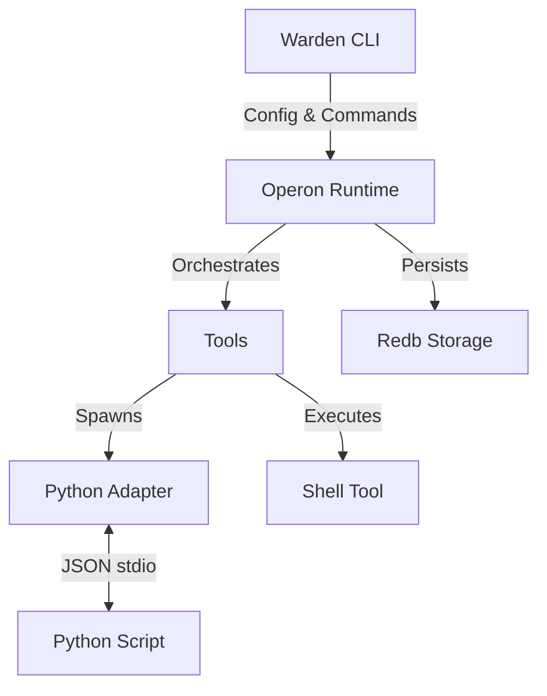

# SilentClaw

**SilentClaw** is a lightweight, high-performance local LLM action orchestrator written in Rust. It serves as a robust successor to OpenClaw, engineered for reliability, speed, and strict system control.

SilentClaw preserves the semantic runtime loop of its predecessor but rebuilds the engine from the ground up to offer:
*   **Safe-by-Default Execution:** Strict dry-run modes and permission controls.
*   **High Concurrency:** Async-first runtime built on `tokio` for parallel tool execution.
*   **Language Agnostic Tools:** seamless Python integration via a JSON-over-stdio adapter protocol.
*   **Observability:** Structured JSON logging via `tracing` for production-grade monitoring.

---

## 🏛️ Architecture

SilentClaw is composed of modular crates designed for separation of concerns:



*   **`warden`**: The command-line interface entry point. Handles configuration parsing (`config.toml`), argument handling (CLAP), and initializes the runtime.
*   **`operon-runtime`**: The core execution engine. Defines the async `Tool` trait, manages the execution loop, handles timeouts, and ensures thread safety. Uses `redb` for persistent storage (e.g., memory/history - *future feature*).
*   **`operon-adapters`**: Provides implementations for external tools.
    *   **Python Adapter**: Runs Python scripts as persistent subprocesses, communicating via a strict JSON line-based protocol.
    *   **Shell Tool**: Safely executes system shell commands with allow/block list support.

## 🚀 Quick Start

### Prerequisites
*   **Rust**: 1.70+ (Stable)
*   **Python**: 3.8+ (for Python tools)

### Installation

Clone the repository and build the release binary:

```bash
git clone https://github.com/tranhoangtu-it/silentclaw.git
cd silentclaw
cargo build --release
```

The binary will be available at `./target/release/warden`.

### Basic Usage

Run a plan file (usually JSON) containing the task definition:

```bash
# Default (defaults to "Auto" mode, usually Dry Run based on config)
./target/release/warden run-plan --file examples/plan_hello.json

# Force Dry Run (No side effects, useful for testing)
./target/release/warden run-plan --file examples/plan_hello.json --execution-mode dry-run

# Force Execution (REAL execution of tools)
./target/release/warden run-plan --file examples/plan_hello.json --execution-mode execute
```

### Logging

Enable structured logs for debugging or monitoring:

```bash
RUST_LOG=info ./target/release/warden run-plan --file examples/plan_hello.json
```

## ⚙️ Configuration

SilentClaw uses a TOML configuration file, typically located at `~/.silentclaw/config.toml` or passed via `--config`.

```toml
[runtime]
# Safety first: default to dry-run to prevent accidental damage.
dry_run = true
# Global timeout for tool execution (in seconds).
timeout_secs = 60
# Max concurrent tools allowed (for parallel execution plans).
max_parallel = 4

[tools.shell]
enabled = true
# Safety: Block dangerous commands.
blocklist = ["rm -rf", "mkfs", ":(){ :|:& };:"]
# Optional: Only allow specific commands (if empty, allows all except blocklist).
allowlist = []

[tools.python]
enabled = true
# Directory to scan for auto-discoverable .py tools.
scripts_dir = "./tools/python_examples"

[tools.timeouts]
# Specific overrides per tool type.
shell = 30
python = 120
```

## 🔌 Developing Tools

### Python Tools
SilentClaw supports Python tools via the `PyAdapter`. Your Python script must read JSON requests from `stdin` and write JSON responses to `stdout`.

**Protocol:**
1.  **Request (from SilentClaw):** `{"id": 1, "method": "function_name", "params": {...}}`
2.  **Response (from Script):** `{"id": 1, "result": ...} ` OR `{"id": 1, "error": "Error message"}`

**Example Script (`my_tool.py`):**
```python
import sys
import json

def handle_request(line):
    req = json.loads(line)
    # Process logic...
    response = {"id": req["id"], "result": "Success"}
    print(json.dumps(response))
    sys.stdout.flush()

if __name__ == "__main__":
    for line in sys.stdin:
        handle_request(line)
```

## 🛠️ Development & Contributing

### Build & Test
```bash
# Format code
cargo fmt

# Lint code
cargo clippy --all -- -D warnings

# Run unit and integration tests
cargo test --all
```

### Build Documentation
```bash
cargo doc --open
```

## ⚖️ License

Distributed under the MIT or Apache-2.0 license.
