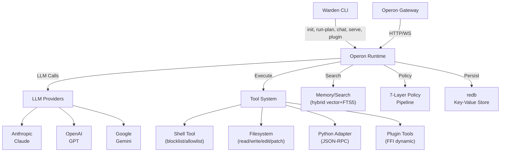

# SilentClaw

[](https://www.rust-lang.org/)
[](.)
[](.)
[](.)

> A high-performance LLM action orchestrator written in Rust — multi-provider, tool-calling, memory-augmented agent runtime.

SilentClaw is a next-generation successor to OpenClaw, engineered from the ground up in Rust for **reliability, speed, type safety, and strict system control**. It combines an async-first architecture with deterministic execution, seamless tool integration, and enterprise-grade security.

---

## ✨ Features

- **Multi-LLM Support**: Anthropic Claude, OpenAI GPT, Google Gemini with automatic failover chain
- **Agent Loop**: Full prompt → LLM → tool calls → execute → observe → repeat cycle
- **Memory & Search**: Hybrid vector + FTS5 (BM25) with RRF merge, auto-reindex on file changes
- **Tool Policy Pipeline**: 7-layer authorization (PermissionCheck, RateLimit, InputValidation, Sandbox, AuditLog, DryRun, Composite)
- **Gateway**: REST + WebSocket with Bearer auth, rate limiting, CORS, input validation, graceful shutdown
- **Plugin System**: FFI dynamic loading with SDK macro for custom extensions
- **Filesystem Tools**: Workspace-scoped read/write/edit/patch with path traversal protection
- **Record/Replay**: Deterministic testing fixtures for reproducible execution
- **Parallel DAG**: Kahn's algorithm scheduler for concurrent task execution
- **Python Integration**: JSON-RPC protocol for seamless Python script execution
- **Structured Logging**: tracing-based JSON logs for production monitoring

---

## 🏛️ Architecture



---

## 📦 Crate Structure

| Crate | Description |
|-------|------------|
| **warden** | CLI entry point (init, run-plan, chat, serve, plugin) |
| **operon-runtime** | Core engine: LLM providers, agent loop, memory, hooks, plugins, policy pipeline |
| **operon-adapters** | Tool implementations: shell, filesystem, python |
| **operon-gateway** | HTTP/WebSocket server with auth + rate limiting |
| **operon-plugin-sdk** | Plugin development SDK with `declare_plugin!` macro |

---

## 🚀 Quick Start

### Prerequisites
- **Rust**: 1.70+ (Stable)
- **Python**: 3.8+ (for Python tools)

### Installation

```bash
git clone https://github.com/tranhoangtu-it/silentclaw.git
cd silentclaw
cargo build --release
```

The binary is available at `./target/release/warden`.

### Basic Usage

```bash
# Interactive agent chat
./target/release/warden chat

# Start gateway server
./target/release/warden serve --port 3000

# Run a plan
./target/release/warden run-plan --file plan.json --execution-mode execute

# List plugins
./target/release/warden plugin list
```

---

## 🌐 LLM Providers

SilentClaw supports multiple LLM providers with automatic failover:

| Provider | Models | Features |
|----------|--------|----------|
| **Anthropic** | Claude 3 (Opus, Sonnet, Haiku) | Tool use, vision, streaming, 200K context |
| **OpenAI** | GPT-4, GPT-4 Turbo, GPT-3.5 | Function calling, vision, streaming, fine-tuning |
| **Google Gemini** | Gemini 1.5 Pro, 1.5 Flash | Tool use, vision, streaming, long context |

**Configuration** (`config.toml`):
```toml
[llm]
# Provider failover chain
providers = ["anthropic", "openai", "gemini"]

[llm.anthropic]
api_key = "${ANTHROPIC_API_KEY}"
model = "claude-3-5-sonnet-20241022"

[llm.openai]
api_key = "${OPENAI_API_KEY}"
model = "gpt-4-turbo"
base_url = "https://api.openai.com/v1"

[llm.gemini]
api_key = "${GOOGLE_API_KEY}"
model = "gemini-1.5-pro"
```

---

## ⚙️ Configuration

SilentClaw uses TOML configuration (typically `~/.silentclaw/config.toml`):

```toml
[runtime]
dry_run = true                    # Safety-first default
timeout_secs = 60                 # Per-tool timeout
max_parallel = 4                  # Concurrent execution

[gateway]
host = "127.0.0.1"
port = 3000
auth_token = "${GATEWAY_TOKEN}"
rate_limit_requests = 100
rate_limit_window_secs = 60

[tools.shell]
enabled = true
blocklist = ["rm -rf", "mkfs", ":(){ :|:& };:"]
allowlist = []

[tools.python]
enabled = true
scripts_dir = "./tools/python_examples"

[tools.filesystem]
workspace_root = "/workspace"
max_file_size = 10485760          # 10MB

[memory]
vector_dimension = 1536
chunk_size = 512
search_limit = 10
```

---

## 🔌 Python Tools

Create Python tools that communicate via JSON-RPC protocol:

```python
import sys
import json

def handle_request(line):
    req = json.loads(line)
    try:
        result = process_request(req["method"], req.get("params", {}))
        response = {"id": req["id"], "result": result}
    except Exception as e:
        response = {"id": req["id"], "error": str(e)}

    print(json.dumps(response))
    sys.stdout.flush()

def process_request(method, params):
    if method == "greet":
        return f"Hello, {params.get('name', 'World')}!"
    raise ValueError(f"Unknown method: {method}")

if __name__ == "__main__":
    for line in sys.stdin:
        handle_request(line)
```

---

## 🛠️ Development & Contributing

### Build & Test

```bash
# Format code
cargo fmt

# Lint (0 warnings enforced)
cargo clippy --all -- -D warnings

# Run all tests (142 pass)
cargo test --all

# Run with logs
RUST_LOG=info cargo test --all -- --nocapture
```

### Build Documentation

```bash
cargo doc --open
```

---

## ⚖️ License

Distributed under the MIT or Apache-2.0 license.
